# Monitor device events using QRadar for violations
> **Note:** The approach used in this code pattern can be used to add any log source not already supported by QRadar out of the box.

Monitoring and preventing security or policy related incidents is an important goal for any organization. Some examples of such incidents are:
- A company vehicle exceeds the specified speed limit.
- An employee attempts to swipe his badge and access a restricted area.
- A company asset is that is bonded to a location is moved to another location.

How can you detect or monitor security or policy related incidents? With the increasing adoption of IoT, a number of security related incidents can be detected from the data generated by embedded IoT devices. For example, the speed and location of connected vehicles can be monitored. 

IBM QRadarSecurity Information and Event Management (SIEM) can help achieve the security goals of an organization. It can consolidate log events and network flow data from thousands of devices, endpoints and applications distributed throughout your network. It correlates all this different information and aggregates related events into single alerts to accelerates incident analysis and remediation.

IBM Watson IoT platform provides IoT devices a mechanism to securely register and sent events. These events can be stored and processed. 
With an integration between the IBM Watson IoT platform and IBM QRadar, an organization can bring a huge number of devices under the monitoring umbrella. 

The Watson IoT Platform is not supported as a log source by default on QRadar. This code pattern demonstrates an integration of the Watson IoT platform with QRadar. The capability demonstrated here can be extended to any other log source that is not supported by QRadar by default. The `Universal DSM support` in QRadar has been used to build this integration.

In this pattern, we will demonstrate the solution with the following usecase. A vehicle has been assigned a speed limit of 100 kmph. If the speed of the vehicle exceeds 100kmph, it is a violation. The vehicle has been fitted with an IoT gateway device that regulary sends the speed information to the IoT platform. 
Whenever the speed of the vehicle exceeds 100kmph, it should generate an offence on the QRadar.

When the reader has completed this pattern, they will understand how to use the `Universal DSM support` available in QRadar to monitor device events from Watson IoT Platform.

The following aspects will be demonstrated in this pattern:
* Create an `Universal DSM` log source in QRadar.
* Create a rule to detect offense in QRadar.
* Subscribe to device events from Watson IoT platform and send them to QRadar in RFC_3164 or RFC_5424 format using Syslog client at https://github.com/CloudBees-community/syslog-java-client.
* Monitor offences if any from the devices on QRadar Log Activity.

> **Note:** The approach used in this code pattern can be used to add any log source not already supported by QRadar out of the box.


## Flow

   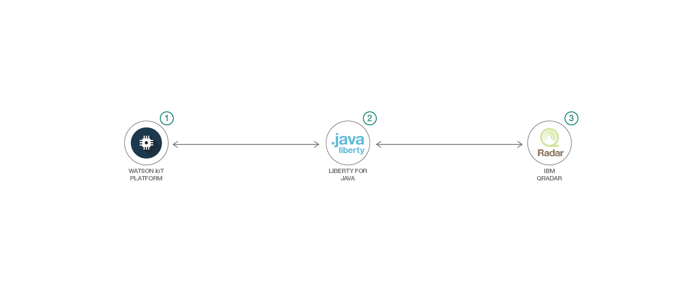

1. Subscribe to device events from Watson IoT Platform. 
2. Use the Syslog client to create a message in RFC_3164 or RFC_5424 format.
3. Send message to QRadar. The pre-created rules are automatically run on the message and an offence is generated for violations.

## Included Components

* [IBM Watson IoT Platform](https://internetofthings.ibmcloud.com/): IBM Watson™ IoT Platform for IBM Cloud gives you a versatile toolkit that includes gateway devices, device management, and powerful application access. By using Watson IoT Platform, you can collect connected device data and perform analytics on real-time data from your organization.  

* [Liberty for Java](https://console.bluemix.net/catalog/starters/liberty-for-java):Develop, deploy, and scale Java web apps with ease. IBM WebSphere Liberty Profile is a highly composable, ultra-fast, ultra-light profile of IBM WebSphere Application Server designed for the cloud.

* [IBM QRadar version 7.3.1](https://developer.ibm.com/qradar/ce/): QRadar Community Edition is a free version of QRadar that is based off of the core enterprise SIEM. 

* [Syslog Java Client](https://github.com/CloudBees-community/syslog-java-client): Client library written in Java to send messages to a Syslog server from CloudBees community(https://github.com/CloudBees-community).

## Featured Technologies

* [Security Information and Event Management](https://en.wikipedia.org/wiki/Security_information_and_event_management): In the field of computer security, security information and event management (SIEM) software products and services combine security information management (SIM) and security event management (SEM). They provide real-time analysis of security alerts generated by applications and network hardware. 

* [Internet of Things](https://en.wikipedia.org/wiki/Internet_of_things)

* [Java](https://en.wikipedia.org/wiki/Java_(programming_language)): Java is a general-purpose computer-programming language that is concurrent, class-based and object-oriented.

## Watch the Video
TBD

## Pre-requisites
* [QRadar Community edition](https://developer.ibm.com/qradar/ce/) : Please visit the site for download and installation instructions.
* [Git Client](https://git-scm.com/downloads) : Please visit the site for download and installation instructions.
* [Maven](http://maven.apache.org/download.cgi) : Please visit the site for download and installation instructions.
* [IBM Cloud account](https://www.ibm.com/cloud/) : Create an IBM Cloud account.
* [Apache Tomcat](http://tomcat.apache.org/) - Install Apache Tomcat to run the Java web application locally.

## Steps

Please follow the below to setup and run this code pattern. 

1. [Install QRadar community edition](#1-install-the-qradar-community-edition)
2. [Create IBM Cloud services](#2-create-ibm-cloud-services)
3. [Register a device on Watson IoT platform](#3-register-a-device-on-watson-iot-platform)
4. [Create log sources and rules on QRadar](#4-create-log-sources-and-rules-on-qradar)
5. [Deploy the web application](#5-deploy-the-web-application)
6. [Analyze results](#6-analyze-results)

### 1. Install QRadar community edition

The version of QRadar that was used for this pattern is 7.3.1.

The installation instructions are available at: 
https://developer.ibm.com/qradar/wp-content/uploads/sites/89/2018/08/b_qradar_community_edition.pdf.

The product can be downloaded at: https://developer.ibm.com/qradar/ce/.
For installation troubleshooting tips, please refer [Troubleshooting guide](DEBUGGING.md).

### 2. Create IBM Cloud services

#### Internet of Things Platform

* Create an instance of Internet of Things Platform at [Internet of Things Platform](https://console.bluemix.net/catalog/services/internet-of-things-platform). 

* Launch and go to `Dashboard`.

### 3. Register a device on Watson IoT platform

* On the Watson IoT Platform `Dashboard`, create a device type `Vehicle` and device with id `Truck_7265`.
* Note down the device credentials. The `Authentication Token` cannot be retrieved later.
  > The device credentials will be used later to send device events.

* Click on `Apps` on the menu.

* Click on `Generate API Key`. Click `Next`.

* Select the role as `Data processor application`. 

* Make a note of the `API Key` and `Authentication Token`. 
  > This will be needed in the web application configuration in the subsequent steps.

  > For more details on the above steps, please refer to this [pattern](https://github.com/IBM/iot-edge-predictive-models-dsx/tree/iot-edge-predictive-models-dsx-bk#1-create-ibm-cloud-services-and-configure).

### 4. Create log sources and rules on QRadar

* Open the `QRadar Console` from a browser. From the menu, select `Admin` to go to the `Admin` view.

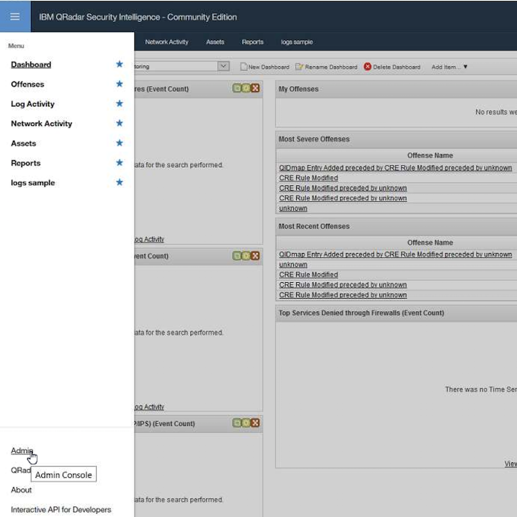

* Scroll down to the `Data sources` section and select `Log Sources`.
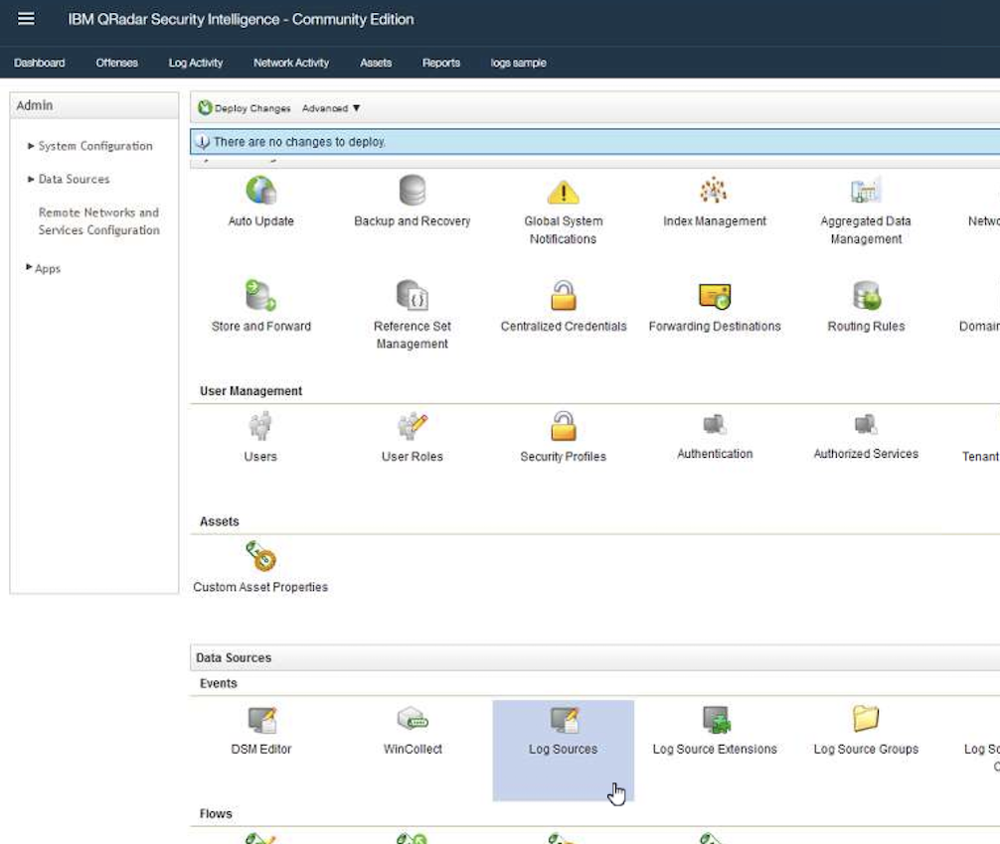

* Click on `Add` to add a new log source.

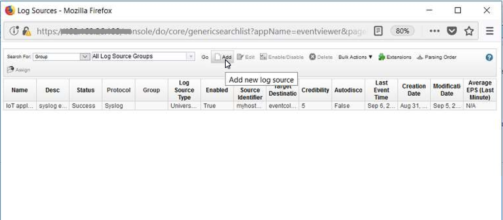

* Configure the log source with the values shown. Click on `Save`.

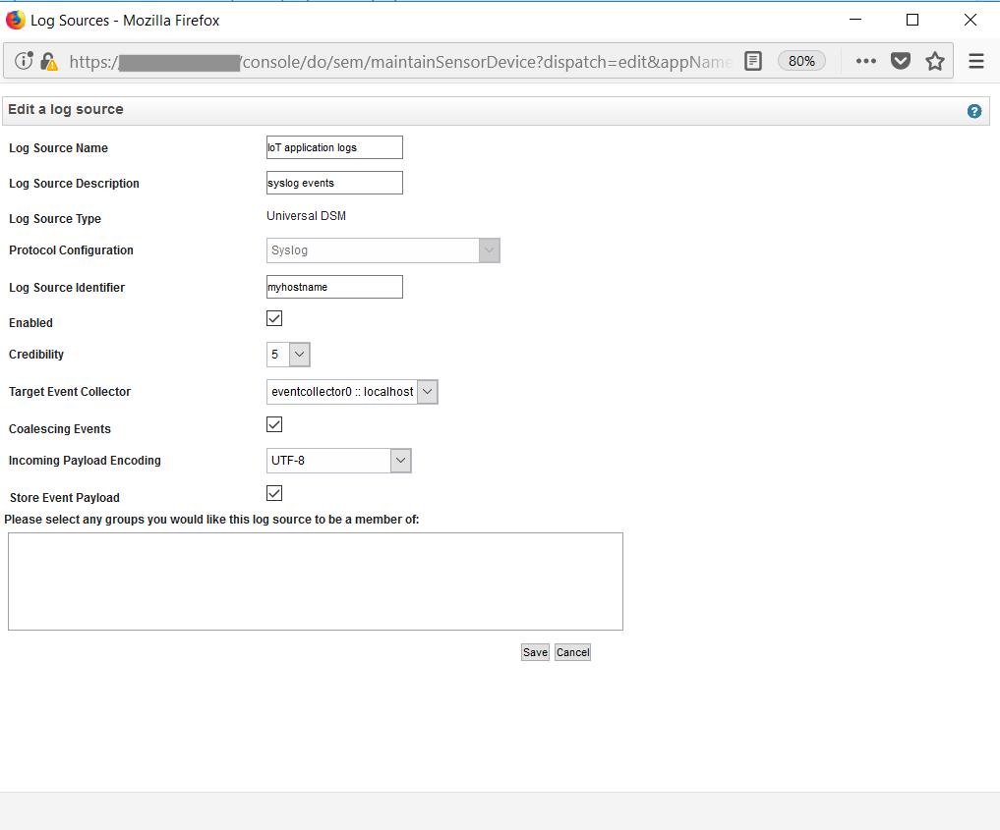

* In the `Admin` view, click on `Deploy changes` to add the newly configured log source.

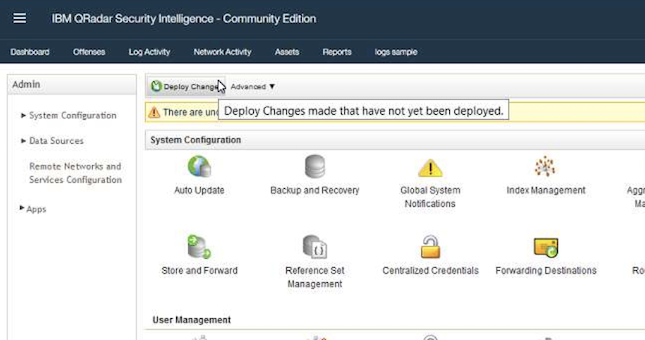

* Go to `Log Activity` view.


* Go to the `Rules` view by clicking on `Rules` menu.


* Select `Actions` and then `New Common Rule`.

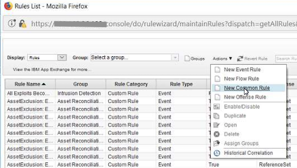

* The rule wizard opens. Click `Next`.

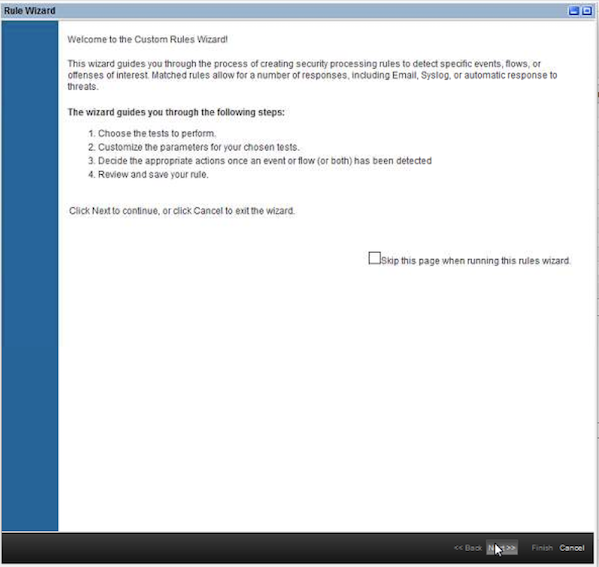

* Select `Events or flows`. Click `Next`.

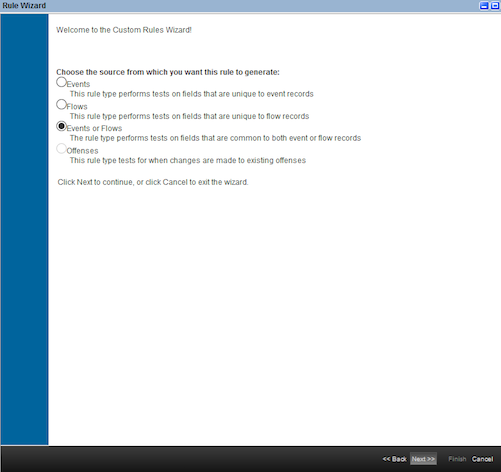

* On the `Rule Test Stack Editor`, enter a filter keyword `payload`.

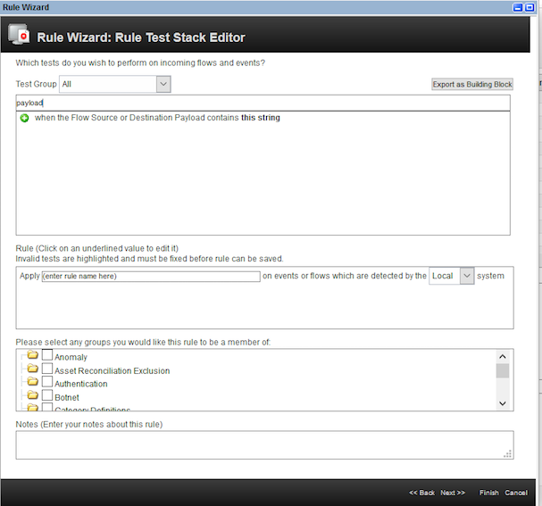

* Select the rule `When the Flow Source or Destination Payload contains this string`. Enter the rule name as `speed violation`. Click on the hyperlink `this string` as shown.


* Enter the string as `SPEEDING`. This is the string that we will send in the device event payload. Click `Submit`.


* Select the group as `Policy`.

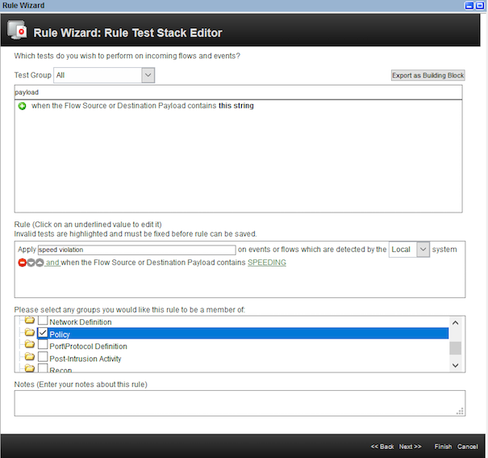

* Click `Next`.

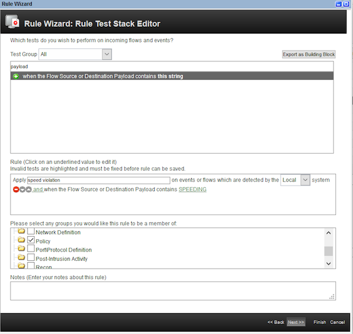

* On the `Rule Response` page, enter the values as shown. Click `Next`.

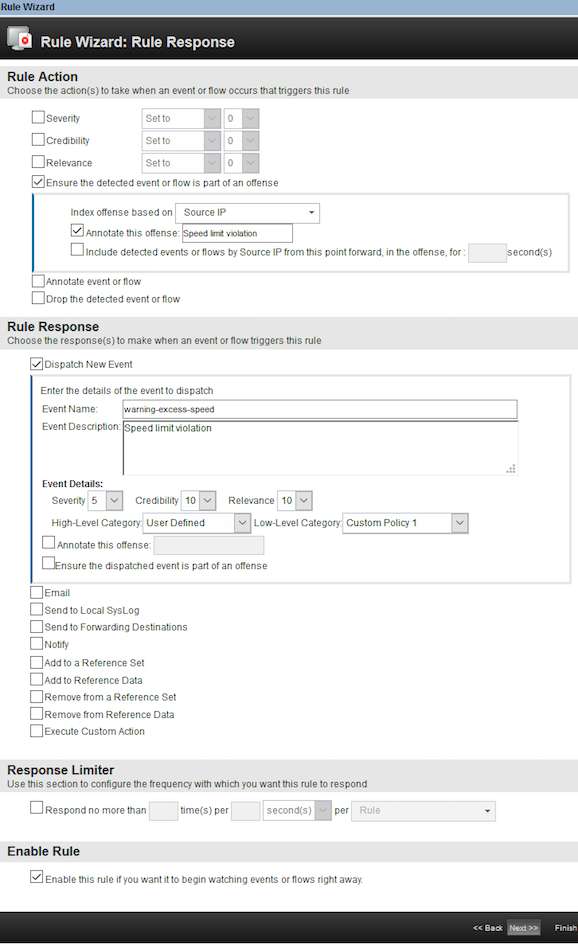

* Click `Finish` on the `Rule summary` page.


* The newly created rule has been added to the list of rules.

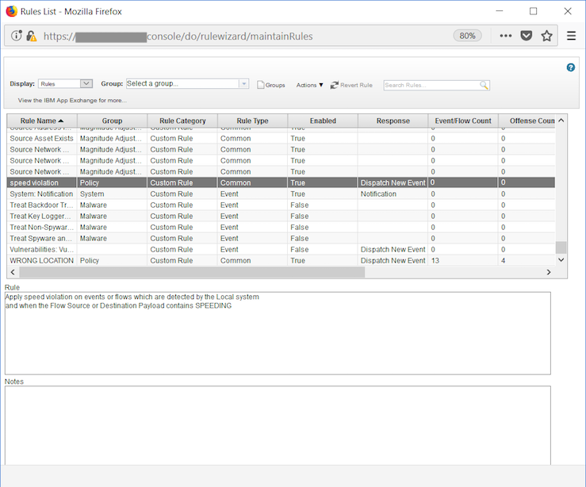


### 5. Deploy the web application

#### To deploy to IBM Cloud

[](https://bluemix.net/deploy?repository=https://github.ibm.com/bkadambi/qradar-monitor-iot-device-events/java)

#### To run the web application locally

* Clone this [git repo](https://github.ibm.com/bkadambi/qradar-monitor-iot-device-events).
* Go to directory `java`.
  ```
     cd java
  ```   
* Run the command `mvn clean package`.
  ```
     mvn clean package
  ```   
* The war file is generated in the target directory - `WatsonIoTQRadarIntegration-1.0.war`. 
  
* Rename the war file to `WatsonIoTQRadarIntegration.war`.
> Note: The war file name is part of the context which is hardcoded in the html files. Hence this renaming is important for the code to work.

* Deploy the war file into Apache Tomcat container.

* Try to access the deployed application at http://[hostname:port]/WatsonIoTQRadarIntegration/index.html.
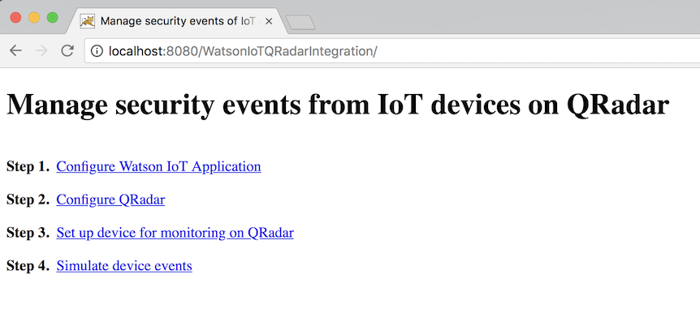

### 6. Analyze the results

To set up the solution and see the working, the below steps will be performed:

* Configure the `Watson IoT` subscriber application with `apikey` credentials.
* Configure the application with `QRadar` installation details and the message format.
* Configure the `Device Type` and `Device ID` whose events need to be monitored on `QRadar`.
* Simulate events for the `Device Type` and `Device ID`.

Let us perform the above steps. Click on `Configure Watson IoT Application`. Enter the `apikey` credentials noted in Step 3.

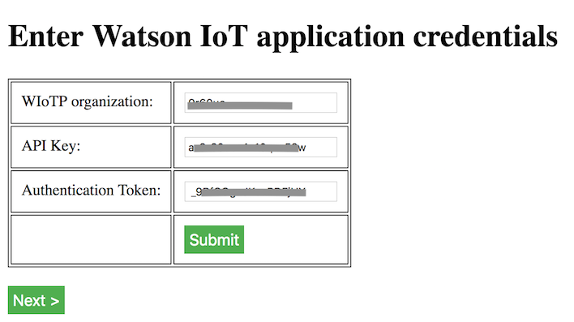

Click on `Submit`. Click on `Next`. Enter the `IP address` of the QRadar installation. Enter a `message format`. Click `Submit`. Click `Next`.


Enter the `Device Type` and `Device ID`. 
> This is the same as what we registered in Step 3.


We are all set with the configuration now. Click on `Next`.

Now, go to the `QRadar` console.

* Go to `Log Activity` view.


* It is recommended to filter the events as shown below to avoid missing the offence. Repeat this for the default events that appear on the `QRadar` log.

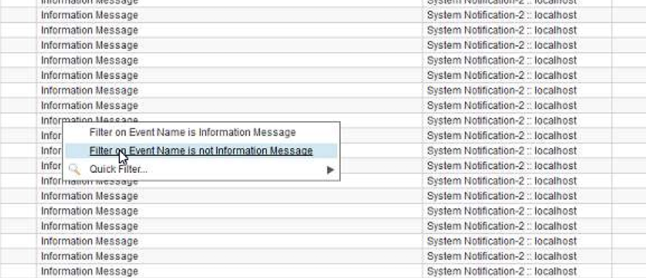

* Select `Real Time (streaming)`.


Now, we are ready to simulate the events. Go back to the web page again.


Enter all the configuration details shown. Enter the event message in the below formats:

Event with no violation - `{“VEHICLENUMBER":"KA05MA1234", "SPEED": "80KMPH", "VIOLATION":"NONE"}} `  
 
Event with a violation - `{“VEHICLENUMBER":"KA05MA1234", "SPEED": "180KMPH", "VIOLATION":"SPEEDING"}} `

> Note: We assume that the speed check is performed at the edge. The key value pair `"VIOLATION":"SPEEDING"` is added on the edge device.

Click on `Send`. The second event will generate an offence on `QRadar`.
  
Go to the `QRadar` console. We can see that there is an offence with regard to the second event we sent.

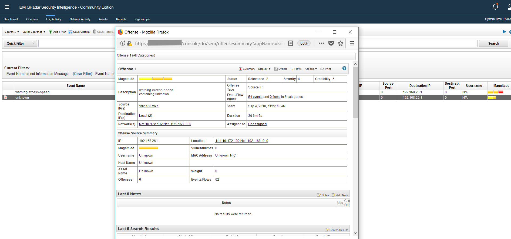

## Troubleshooting

[See DEBUGGING.md.](DEBUGGING.md)

## License
[Apache 2.0](LICENSE)

